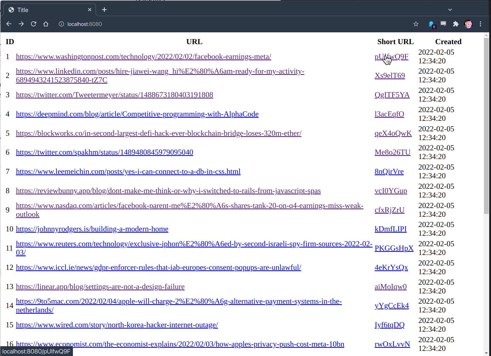
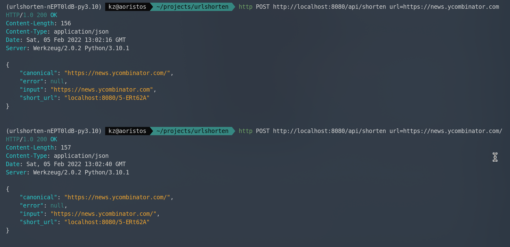
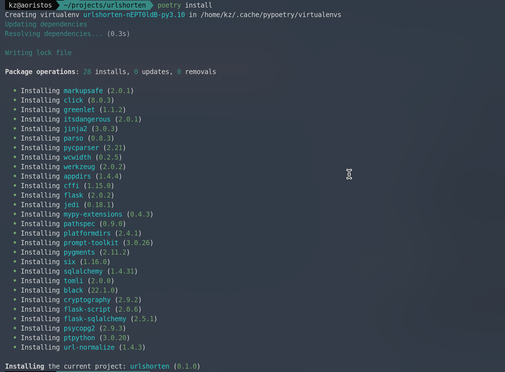

# urlshorten
#### A simple url shortener web service written in Python.
Author: Kevin Zeidler
Date: 2021-02-04

## Assignment

The assignment is as follows:

```
Level: mid-level
Assignment:
Read this: URL shortening
Write a web service in Python that
1) Accepts a URL and returns a shortened version.
2) Takes a shortened url and returns the original longer URL
Use something like Github to publish your solution. Send me the link to the repo.
There should be a README file explaining how to setup and run your service.
Notes:
This assignment is purposefully vague. I give you a link to get started on what url shortening is
but that's it. I don't specify what kind of web service, just the two things it needs to do, and it has
to be in Python.
Time:
We appreciate you working on this task in your own time!
Don't spend too much time on this assignment. Try to spend only about 2-3 hours on this.
There will be gaps in your solution. Use code comments to describe any code gaps. You will not
be able to create a finished product!
Don't stress out if your code doesn't run.
Note how long you spend working on this in your README.
Grading:
I am looking for a few things:

1) You can grasp a problem (in the case url shorteners) and come up with a
rudimentary solution.
2) You understand the basics of Python and how to organize code.
3) You can use frameworks to handle much of the boilerplate functionality.
I will read over your solution and then schedule a meeting with you where we will go through it. I
want to see how well you talk about your solution, trade-offs, things you didn't get to but would
have done, real-world issues, etc.
If you have any questions please feel free to email me at jason.thigpen@unitedmasters.com.
```

___

## Overview
Hey there! 

My name is Kevin Zeidler, and I'm a software engineer based in San Diego applying for the role of Backend Engineer at UnitedMasters.

This is a (fairly crude) URL shortener service that allows you to shorten your URLs. I created this as part of the skills assessment stage of
the application. In accordance with the instructions I've been given, I have tried to suppress the urge to develop
a complete, production-caliber application full of bells and whistles like in-memory DB caching, failsafe error handling, and
a the existence of a strategy for handling certain doomsday scenarios like, for instance, what happens when the number of the 
index grows beyond `64**8`. Indeed, should the total size of the index exceed approximately 2,814 trillion URLs, the service 
will have no idea and start overwriting previously-generated short URLs with new target URLs -- assuming that  it hasn't already burst into 
flames by that point. So please, go easy on it. 


Certain backend dependencies have been replaced with mock versions for the sake of 
simplicity, and there are one or two known glitches that I call out below. On the whole though, I think this is an efficient, working solution with an interesting trick or two up its sleeve. I'm pretty happy with the result.

____


## Screenshots
Although it's mainly a transparent, backend redirection service, it does go out of its way to provide useful HTML/JSON responses in some cases, like: 

### Main landing page

This is the main landing page. Just shows a simple table of all the short URLs and their corresponding target URLs, which is useful for verifying that the service is working.

### POST requests

This is the JSON response returned when a client sends a POST request to the main API endpoint. Note that, while the two URLs sent to the service are subtly different, they resolve to the same target URL and therefore produce the same short URL. Neat!

### 404 Errors

This is the page that is shown when a client sends a request to a short URL that doesn't exist. 

____

## Meta
Time-wise, took about 6 hours to complete, of which roughly 4 hours involved actively writing code. Tbh I've spent most of the past 
2 hours documenting the code and trying to explain the more exotic code constructs, like the Linear Congruential Generator-based 
conversion of URLs to shortcodes. 


* Start: `11:02PM Friday, February 4th, 2020`
* End: `4:44AM Saturday, February 4th, 2020`

___

## Installation
With `poetry` installed, you can install this package with:

```
    $ poetry install
```

which should produce an output that looks something like so:


___
## Usage
Activate the poetry virtual environment with `poetry shell`, then run:

```
    $ cd urlshorten
    $ python routes.py
```

The app should now be running on [http://localhost:8080](http://localhost:8080). Don't sweat the console errors; unless something weird is going on, that's  just the database preventing duplicate URLs from being added as expected. 

___

## Strategy
1. Create a database table to store the shortened URLs
2. Create a function to generate a unique short URL from a long URL
3. Create an HTTP endpoint that redirects previously generated short URLs to their original target URLs

Along the way I've implemented a few features that I think are useful:
* Nice HTML index.html landing page that lists all the shortened URLs in the database
* URL canonicalization (see [here](https://en.wikipedia.org/wiki/Canonical_URL)) **WARNING: Broken! Weird character encoding issues I don't want to deal with right now**
* Constant "[O(1)](https://www.ilikebigbits.com/2014_04_21_myth_of_ram_1.html)" insertion time, irrespective of the size of the index, achieved without substantially increasing the memory footprint. (!) If this seems impossible, it actually did to me too, at first, but then I happened on a marvelous little Wikipedia page that confirmed my hunch that it's possible to do this without assigning consecutive pigeons to adjacent cells in the address space (e.g. 'aaaaaa', 'aaaaab', 'aaaaac', and so on). See next bullet point.  
* A cute pseudorandom variant of RNG called a Linear Congruential Generator (LCG) used to quickly and efficiently generate short URLs that *look* random, but are actually guaranteed to be unique (see [here](https://en.wikipedia.org/wiki/Linear_congruential_generator)). This prevents weird, sigmoidal growth patterns in the insertion time complexity as a result of the increased probability of hash collisions.  🧙🪄λ
